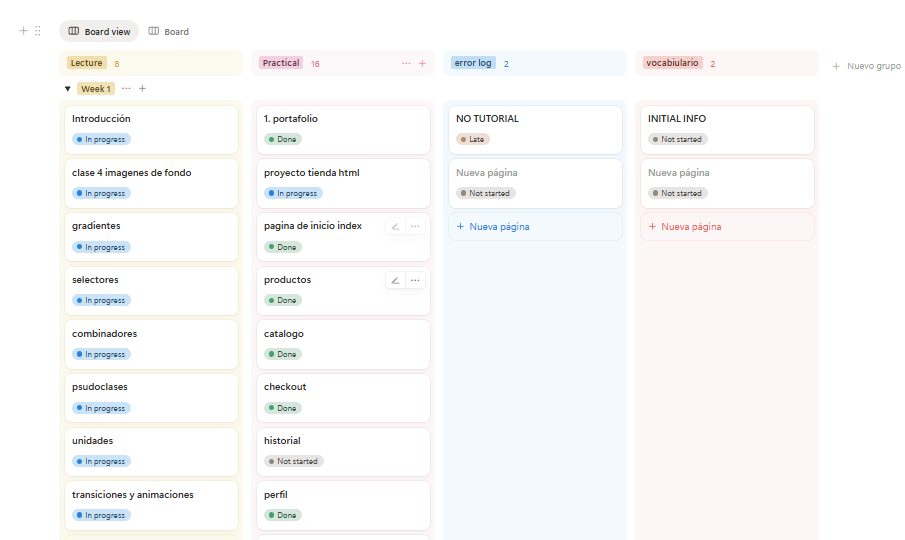
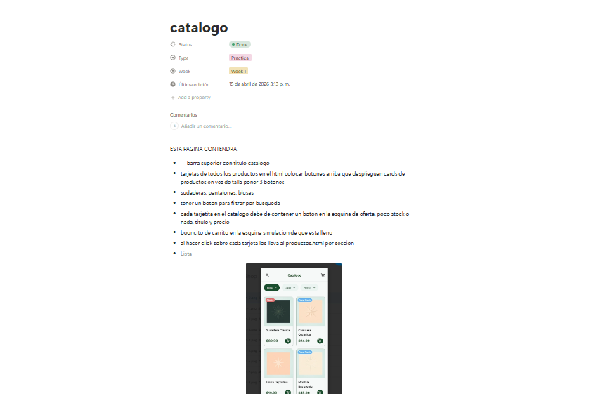

# 🛒 CampusShop - E-commerce Modular

Este proyecto consiste en el desarrollo de una interfaz de usuario para una tienda virtual, diseñada con un enfoque en la experiencia del usuario (UX), el rendimiento y una estructura de código limpia y escalable.

## 👤 Autora
* **Nombre:** Evelyn Barrios
* **GitHub:** [barriosevelyn488-web]
* **Rol:** Estudiante de Programación (Full Stack Developer) en Campusland.

## 🛠️ Tecnologías y Metodologías
* **HTML5:** Estructura semántica para mejorar la accesibilidad.
* **CSS3:** Uso de Variables CSS (`:root`) para una gestión de colores centralizada.
* **Metodología Modular:** Separación de estilos en archivos específicos (`base`, `layout`, `components`, `responsive`).
* **Diseño Responsivo:** Adaptación total a dispositivos móviles y escritorio mediante Media Queries.

## 🚀 Lo que se trabajó (Paso a Paso)

### 1. Organización del Código
Se implementó una arquitectura de archivos CSS para mantener el proyecto ordenado:
* **base.css:** Definición de la paleta de colores corporativa y tipografía.
* **layout.css:** Estructura general, contenedores y posicionamiento con Flexbox.
* **components.css:** Estilos de elementos reutilizables como botones, tarjetas y campos de entrada.
* **responsive.css:** Ajustes específicos para que la tienda sea cómoda de usar en cualquier pantalla.

ademas se utilizo notion para hacer un mapa de lo que se tenia que realizar en cada pagina

### 2. Flujo de Pago (Checkout)
Se diseñó un sistema de pago lógico que guía al usuario:
* **Datos de Envío:** Formulario optimizado para la captura de información.
* **Métodos de Pago:** Selección visual entre Visa, MasCard y Pago Contra Entrega.
* **Navegación Inteligente:** El sistema redirige al usuario según su elección (Formulario de tarjeta para pagos electrónicos o Pantalla de Éxito para contra entrega).

### 3. Historial de Pedidos
Se creó una interfaz de historial donde el cliente puede consultar sus compras pasadas, incluyendo:
* ID de orden y fecha.
* Total de la compra.
* Etiquetas de estado (Entregado, En camino, Cancelado) con códigos de color para una lectura rápida.

### 4. Atención al Cliente
Integración directa con WhatsApp para permitir una comunicación inmediata entre el comprador y el asesor de ventas.

## 📂 Estructura del Proyecto
* `index.html`: Página principal / Catálogo.
* `checkout.html`: Proceso de pago y selección de método.
* `formtarjeta.html`: Formulario para datos bancarios.
* `exitoso.html`: Confirmación de pago finalizado.
* `historial.html`: Seguimiento de pedidos del usuario.
* `/css`: Carpeta de estilos modulares.
* `/img`: Recursos visuales y productos.

